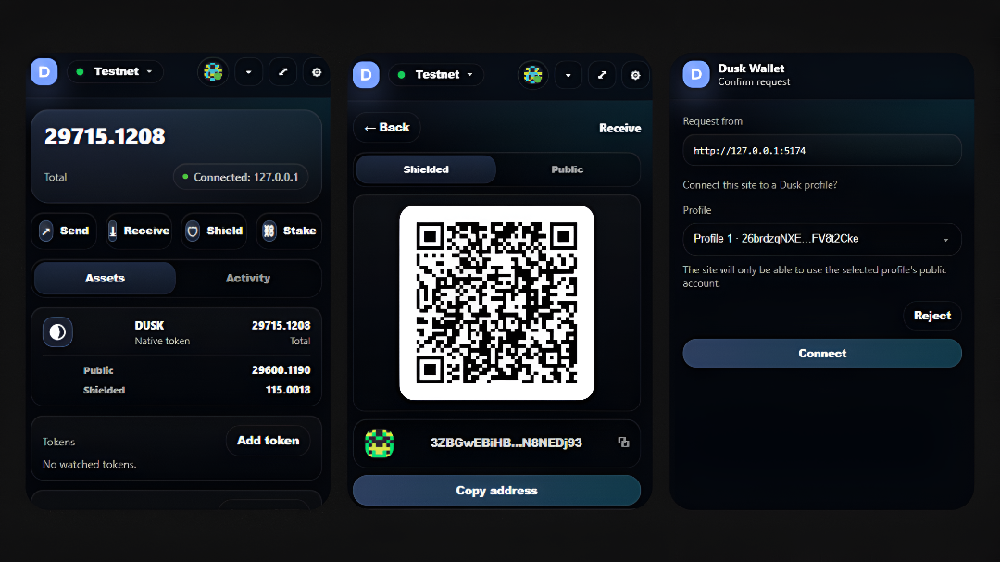

# Dusk Wallet

A non-custodial wallet for [Dusk](https://dusk.network). Chrome and Firefox extension builds from one codebase.

**Your keys. Your DUSK. No middleman.**

<p align="center">
  <a href="https://github.com/dusk-network/wallet/actions/workflows/ci.yml">
    
  </a>
  &nbsp;
  <a href="https://github.com/dusk-network/wallet/actions/workflows/release.yml">
    
  </a>
  &nbsp;
  <a href="https://codecov.io/gh/dusk-network/wallet">
    
  </a>
  &nbsp;
  <a href="https://github.com/dusk-network/wallet/stargazers">
    
  </a>
  &nbsp;
  <a href="https://discord.gg/dusk-official">
    
  </a>
  &nbsp;
  <a href="https://x.com/DuskFoundation/">
    
  </a>
  &nbsp;
  <a href="https://docs.dusk.network">
    
  </a>
</p>



## Features

🔐 **Self-custody** — Your mnemonic never leaves your device. Encrypted at rest.

⚡ **Public & Shielded** — Send from your public account or shield funds for privacy.

🌐 **dApp Ready** — Connect to any Dusk dApp through event-based provider discovery.

🔄 **Multi-network** — Switch between mainnet, testnet, devnet, or custom nodes.

🧩 **Shared runtime** — Extension targets share the same wallet engine and UI shell.

## Install

### Chrome Extension

From a fresh checkout:

```bash
npm install
npm run build:chrome
```

Then load `dist/` as an unpacked extension in `chrome://extensions` (Developer mode).

### Firefox Extension

From a fresh checkout:

```bash
npm install
npm run build:firefox
```

Then load `dist-firefox/` as a temporary add-on in `about:debugging`.

## For dApp Developers

The extension announces an EIP-1193-style provider through Dusk discovery events. Dusk isn't EVM, but the provider patterns are familiar.

```js
const providers = [];

window.addEventListener("dusk:announceProvider", (event) => {
  providers.push(event.detail);
});

window.dispatchEvent(new Event("dusk:requestProvider"));

const dusk = providers[0]?.provider;
const [account] = await dusk.request({ method: "dusk_requestAccounts" });

dusk.on("accountsChanged", console.log);
dusk.on("chainChanged", console.log);
```

Full API reference: [docs/provider-api.md](docs/provider-api.md)

## Architecture

```
src/
├── background/      # Extension service worker
├── ui/              # Popup, full view, notifications
├── shared/          # Wallet logic (works everywhere)
├── platform/        # Platform abstraction (extension vs tauri)
└── wallet/          # Engine interface
```

The wallet engine runs in an offscreen document for extension builds. The shared runtime is structured so other hosts can reuse the same cryptographic core.

Additional documentation:

- [Provider API](docs/provider-api.md)
- [Architecture](docs/ARCHITECTURE.md)
- [Security notes](docs/SECURITY.md)
- [Contributing](CONTRIBUTING.md)

## Development

```bash
npm run build:extension   # Build extension → dist/
npm run build:firefox     # Build Firefox extension → dist-firefox/

# Local Rusk node (Docker)
npm run rusk:up
npm run rusk:wait

# UI component workbench
npm run storybook

# E2E (Playwright + Docker Rusk)
npm run e2e:rusk
```

## Security

- Mnemonic encrypted with user password (PBKDF2 + AES-GCM)
- No analytics, no tracking, no remote calls except to your chosen node

## License

MIT
